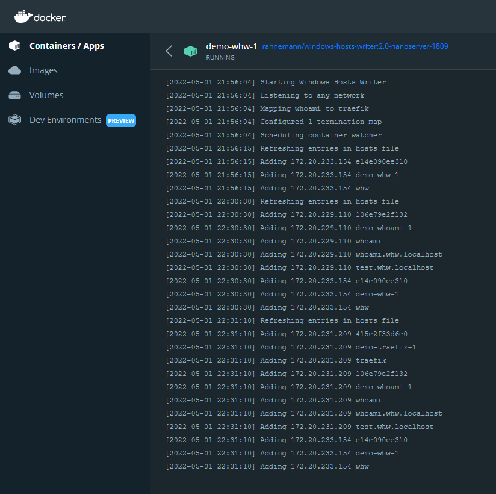

# Windows Hosts Writer

Windows Hosts Writer (WHW) is a service designed to map the IP address from running containers (typically Docker) to a friendly canonical name written to the hosts file on Microsoft Windows.

## Getting Started

Begin by opening `docker-compose.yml` and add the following service:

```yaml
  whw:
    image: ${WHW_IMAGE}
    volumes: 
      - C:\windows\system32\drivers\etc:C:\driversetc
      - source: \\.\pipe\docker_engine\
        target: \\.\pipe\docker_engine\
        type: npipe
```

The token `${WHW_IMAGE}` can be configured in the in environment file **.env** like the following:

```text
WHW_IMAGE=rahnemann/windows-hosts-writer:2.0-nanoserver-1809
```

With just this you are ready to get started. Spin up your compose file with something like `docker compose up -d whw`.

Open up your hosts file in **notepad** to check out the the changes.

```text
172.20.233.154	e14e090ee310		#by whw
172.20.233.154	demo-whw-1		#by whw
172.20.233.154	whw		#by whw
```

The IPs are automatically generated by the container software so we won't worry about those for now. Notice that for the same IP **whw** has recorded three entries: the container ID, container name, and service name. 

This is in part made possible by the volume we configured from the local machine to the container. Don't worry, when the **whw** container shuts down these entries are cleaned up.

## Termination Map

If you are working with additional load balancing software such as Traefik you'll want some or all of the services to map back to the IP of the load balancer. 

Add Traefik to your `docker-compose.yml` followed by adding a new environment variable to our **whw** service.

The `TERMINATION_MAP` environment variable begins with a comma delimitated list of service names followed by `:traefik`.

```yaml
    environment:
      TERMINATION_MAP: whoami:traefik
```

Additionally, you may wish to add aliases to each of the services. These are great when you want additional hostname bindings mapped to the service. This can be accomplished by adding network aliases to your configuration.

```yaml
    networks:
      default:
        aliases: [ "${WHOAMI_HOST}" ]
```

Let's add a more complete example to our `docker-compose.yml`.

```yaml
services:
  traefik:
    isolation: ${TRAEFIK_ISOLATION}
    image: ${TRAEFIK_IMAGE}
    command:
      - "--ping"
      - "--api.insecure=true"
      - "--providers.docker.endpoint=npipe:////./pipe/docker_engine"
      - "--providers.docker.exposedByDefault=false"
      - "--providers.file.directory=C:/etc/traefik/config/dynamic"
      - "--entryPoints.websecure.address=:443"
      - "--entryPoints.websecure.forwardedHeaders.insecure"
    ports:
      - "443:443"
      - "8079:8080"
    healthcheck:
      test: ["CMD", "traefik", "healthcheck", "--ping"]
    volumes:
      - source: \\.\pipe\docker_engine\
        target: \\.\pipe\docker_engine\
        type: npipe
      - ./docker/traefik:C:/etc/traefik
  whoami:
    image: stefanscherer/whoami:2.0.1
    environment:
      - ASPNETCORE_URLS=http://+:80
    networks:
      default:
        aliases: [ "${WHOAMI_HOST}" ]
    labels:
      - "traefik.enable=true"
      - "traefik.http.routers.whoami-secure.entrypoints=websecure"
      - "traefik.http.routers.whoami-secure.rule=Host(`${WHOAMI_HOST}`)"
      - "traefik.http.routers.whoami-secure.tls=true"
  whw:
    isolation: ${ISOLATION}
    image: ${WHW_IMAGE}
    volumes: 
      - C:\windows\system32\drivers\etc:C:\driversetc
      - source: \\.\pipe\docker_engine\
        target: \\.\pipe\docker_engine\
        type: npipe
    environment:
        TERMINATION_MAP: whoami:traefik
```

Then to our `.env`.

```text
COMPOSE_PROJECT_NAME=demo
TRAEFIK_IMAGE=traefik:v2.6.3-windowsservercore-1809
TRAEFIK_ISOLATION=hyperv
ISOLATION=default
WHW_IMAGE=rahnemann/windows-hosts-writer:2.0-nanoserver-1809
WHOAMI_HOST=whoami.whw.localhost test.whw.localhost
```
Starting up with additional services mapped to **traefik** will result in something like the following:

```text
172.20.231.209	415e2f33d6e0		#by whw
172.20.231.209	demo-traefik-1		#by whw
172.20.231.209	traefik		#by whw
172.20.231.209	106e79e2f132		#by whw
172.20.231.209	demo-whoami-1		#by whw
172.20.231.209	whoami		#by whw
172.20.231.209	whoami.whw.localhost		#by whw
172.20.231.209	test.whw.localhost		#by whw
172.20.233.154	e14e090ee310		#by whw
172.20.233.154	demo-whw-1		#by whw
172.20.233.154	whw		#by whw
```

## Logging

We've also added logging to the output visible through Docker so you can quickly see what **whw** is doing.

